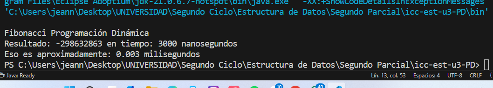
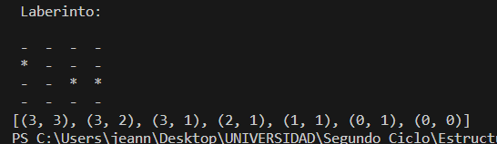

# Proyecto Java: Ejercicios de Programación Dinámica & Laberinto

Este README describe cómo está organizado el proyecto, cómo compilarlo y ejecutarlo, y qué salida esperar.

---

## 📂 Estructura de carpetas


```bash

├── src
│ ├── app
│ │ └── App.java
│ ├── controllers
│ │ └── LibroController.java
│ ├── models
│ │ └── Book.java
│ ├── pd
│ │ └── EjerciciosPd.java
│ ├── maze
│ │ ├── Maze.java
│ │ ├── Cell.java
│ │ ├── MazeSolver.java
│ │ └── MazeSolverRecursivo.java
│ └── test
│ ├── LibroControllerTestSet.java
│ └── LibroControllerTestMap.java
└── bin ← aquí van los .class compilados
```






---

## 🛠️ Prerrequisitos

- JDK 11+ instalado y en tu `PATH`
- Git (opcional, para clonar el repo)

---

## ⚙️ Compilar

Desde la raíz del proyecto, corre:

```bash
javac -d bin src/**/*.java
